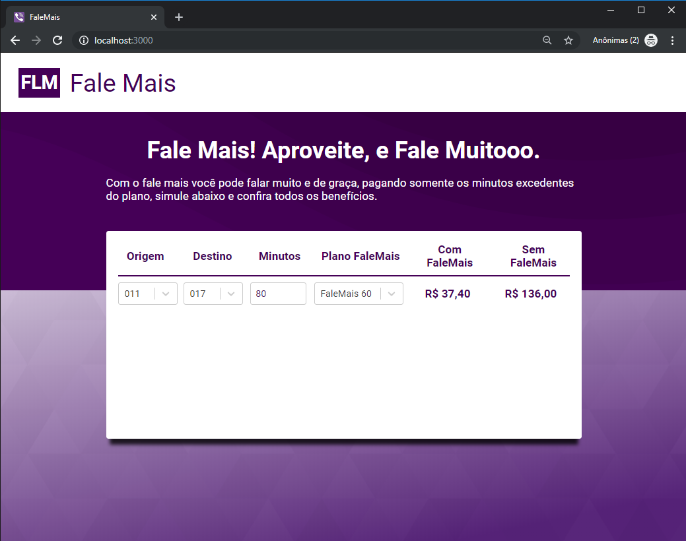
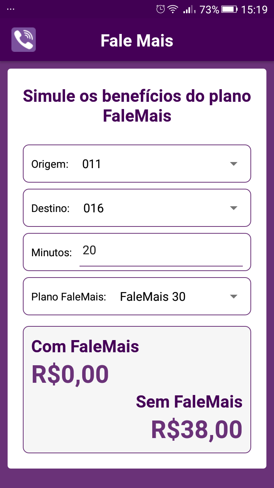

# Show me the code

<h1 align="center">
  
  
</h1>

## Instalação

Recomenda-se utilizar o gerenciador de pacotes [`yarn`](https://yarnpkg.com), para instalar as dependência de desenvolvimento do projeto.

### Clone do repositório ou Arquivo ZIP 

Clonar o repositório remoto para a máquina local

```sh
git clone https://github.com/EvertonGavioli/vizir-desafio-falemais.git
```

Ou extrair o arquivo zip para um diretório na máquina local

# Aplicação WEB

Selecionar o diretório local onde foi clonado o repositório

```sh
vizir-desafio-falemais/frontend-web
```

Instalar as dependências do projeto com o seguinte comando

```sh
yarn install
```

Após o termino da instalação, rodar a aplicacão localmente

```sh
yarn start
```

A aplicação deve ser iniciada e estar rodando em

```sh
http://localhost:3000
```

## Testes Web

Para executar os testes na aplicação web, deve selecionar o diretório local onde foi clonado o repositório

```sh
vizir-desafio-falemais/frontend-web
```

Executar o seguinte comando para iniciar os testes

```sh
yarn test
```

Para gerar o relatório de cobertura dos testes executar o seguinte comando

```sh
yarn coverage
```

Após o término da geração do relatório, a página de coverage dos testes pode ser acessada em

```sh
vizir-desafio-falemais/frontend-web/src/__tests__/coverage/lcov-report/index.html
```

# Aplicação Mobile

## Para apenas instalar o aplicativo 

Foi gerado um arquivo apk do aplicação para facilitar a instalação em um celular android, copiar para o dispositivo e efetuar a instalação

```sh
vizir-desafio-falemais/mobile/apk/falemais-release.apk
```

## Para executar em modo de desenvolvimento

Selecionar o diretório local onde foi clonado o repositório

```sh
vizir-desafio-falemais/mobile
```

Instalar as dependências do projeto com o seguinte comando

```sh
yarn install
```

Após o termino da instalação das dependências, para rodar o aplicativo deve ser necessário um emulador ou um dispositivo físico android com modo desenvolvedor e debug habilitado

```sh
yarn react-native run-android
```

```sh
yarn react-native start
```

## Testes Mobile

Para executar os testes na aplicação mobile, deve selecionar o diretório local onde foi clonado o repositório

```sh
vizir-desafio-falemais/mobile
```

Executar o seguinte comando para iniciar os testes

```sh
yarn test
```

Para gerar o relatório de cobertura dos testes executar o seguinte comando

```sh
yarn coverage
```

Após o término da geração do relatório, a página de coverage dos testes pode ser acessada em

```sh
vizir-desafio-falemais/mobile/__tests__/coverage/lcov-report/index.html
```

